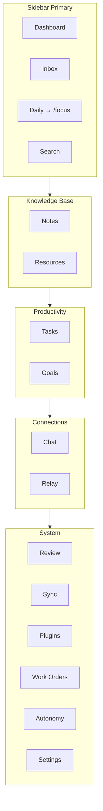
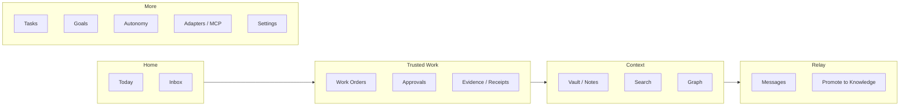

# MindVault Product Experience Audit & Market-Leading Roadmap

- **Status:** Canonical UX / UI / IA / competitive / accessibility / frontend experience audit
- **Date:** 2026-07-31
- **Baseline:** `3de2371` (main) + live frontend inventory
- **Supersedes:** [`docs/ux-audit.md`](ux-audit.md) (Feb 2026) for systemic judgment; retains that file as historical page-level notes
- **Authority alignment:** Product direction = [`MINDVAULT_NEXT_MASTER_PLAN.md`](MINDVAULT_NEXT_MASTER_PLAN.md); execution status = [`IMPLEMENTATION_BACKLOG.md`](../IMPLEMENTATION_BACKLOG.md); category wedge = Trusted Human–Agent Work System ([`strategy/unicorn/CATEGORY_DESIGN_AND_POSITIONING.md`](strategy/unicorn/CATEGORY_DESIGN_AND_POSITIONING.md))
- **Surfaces audited:** `frontend/` (primary product), `web/` (admin), `extensions/mindvault-clipper/` (capture)
- **Method:** Codebase-first (routes, components, tokens, stores, API clients), evidence-graded claims, Nielsen heuristics, WCAG 2.2, SaaS pattern library. Presence of UI ≠ verified product capability.

---

## 0. Executive Verdict

MindVault today presents as a **feature-rich local-first personal knowledge + productivity shell** (notes, tasks, search, chat, inbox, goals, plugins) with an emerging **governed agent-work surface** (Work Orders, Autonomy, Proposal Inbox). The kernel and strategy docs aim at a **Trusted Human–Agent Work System** on a path to a **Sovereign Context Fabric**. The UI has not yet caught up to that category claim.

| Dimension | Score (0–5) | One-line judgment |
|-----------|------------:|-------------------|
| Product clarity in UI | 2.0 | Still reads as PKM/dashboard; wedge (trusted agent work) is buried under System |
| Information architecture | 2.5 | Grouped nav helps; many routes orphaned; Daily label → `/focus` mismatch |
| Visual / design system | 2.0 | Tokens exist; primitives exist; adoption ~near-zero; indigo/sky/violet noise |
| Interaction craft | 3.0 | Command palette, capture, undo, connection status are strong; modals/confirm weak |
| Accessibility (WCAG 2.2) | 2.0 | Scattered ARIA; Modal lacks focus trap; no axe suite; fonts not self-hosted |
| Feature completeness (PKM) | 3.5 | Broad surface; polish uneven; dual editors |
| Feature completeness (wedge) | 2.5 | Work Orders UI exists; receipts/trust ledger/Spaces membership UX missing |
| Competitive parity (category) | 2.0 | Wins on local + grants thesis; loses on taste, IA focus, collab UX |
| Performance perception | 3.0 | Optimistic task/note paths; ad-hoc loading; no skeleton system |
| Market-leading readiness | 1.5 | Foundation for differentiation exists in engine; experience does not yet sell it |

**North-star redesign thesis:** Stop competing as “Obsidian + Notion + Linear in one sidebar.” Recompose the product around **Capture → Decide → Delegate → Prove** with the vault as sovereign substrate—not as the hero category.

---

## 1. Product Category (Critical)

### 1.1 What buyers think it is (from UI)

Opening the Tauri/Svelte app, a new user sees: Dashboard widgets, Inbox, Daily, Search, Notes, Tasks, Goals, Chat. That is the mental model of a **personal OS / second brain**.

Evidence:
- Onboarding copy: “Your local-first knowledge and execution workspace” (`frontend/src/routes/onboarding/+page.svelte`)
- Sidebar groups Knowledge / Productivity / Connections / System (`frontend/src/routes/+layout.svelte`)
- Work Orders & Autonomy live under **System**, peer to Plugins/Sync—not as the hero job

### 1.2 What the company claims it is (from strategy)

| Layer | Label | Source |
|-------|--------|--------|
| Wedge (sell now) | Trusted Human–Agent Work System | `docs/strategy/unicorn/CATEGORY_DESIGN_AND_POSITIONING.md` |
| Platform end-state | Sovereign Context Fabric | Master plan §1 |
| Explicit non-goals for wedge | Pure MCP gateway, Slack clone, consumer second-brain | `PRIMARY_WEDGE_DECISION.md` |

### 1.3 Category conflict (must resolve in UX)

The product will not become best-in-class by winning PKM feature checklists against Obsidian/Notion. It becomes best-in-class by making **accountable agent work with owned context and evidence** feel as fast and delightful as Linear feels for issues—while Obsidian remains a supported authoring environment (master plan Locked Decisions).

**Design implication:** IA, empty states, onboarding, dashboard, and first-run must teach the wedge. PKM surfaces remain excellent *supporting* tools, not the category claim.

---

## 2. Codebase Architecture (Experience-Relevant)

### 2.1 Stack

| Layer | Reality | Path |
|-------|---------|------|
| App shell | SvelteKit 2 + Svelte 5 + Vite 7 + Tailwind 4, SPA (`ssr=false`) | `frontend/` |
| Desktop | Tauri 2 (`mindvault-desktop`) | `frontend/src-tauri/` |
| Tokens | CSS vars `--mv-*` (RGB channels) | `frontend/src/lib/styles/tokens.css` |
| Utilities | `.mv-card`, `.mv-btn*`, `.mv-input`, `.mv-badge*`, `.mv-tabs` | `frontend/src/app.css` |
| Offline | Dexie `MindVaultDB` | `frontend/src/lib/db/` |
| API | 56 client modules → `http://127.0.0.1:9470` | `frontend/src/lib/api/` |
| Admin (secondary) | Vite vanilla monolith ~6.6k LOC | `web/src/admin.js` |
| Clipper | MV3 extension | `extensions/mindvault-clipper/` |

### 2.2 Routing inventory (43 pages)

**Primary hubs (with `?view=` composition):** Notes, Tasks, Bookmarks/Resources, Review  
**Redirect shims (12):** `/calendar`, `/kanban`, `/timeline`, `/graph`, `/canvas`, `/pdf`, `/media`, `/templates`, `/flashcards`, `/stats`, `/tags`, `/insights`  
**Orphan / under-nav routes:** `/plan`, `/voice`, `/daily`, `/federation`, `/adapters`, `/provenance`, `/onboarding`, `/trash`, `/settings/*` subtree  
**Layouts:** single root `+layout.svelte` — no nested settings/knowledge layouts

### 2.3 Component & state inventory

| Kind | Approx count | Maturity |
|------|-------------:|----------|
| Route pages | 43 | Uneven; several god-pages |
| `src/lib` components | ~86 | Thin primitives; heavy feature components |
| Stores | 17 | Solid offline/task patterns |
| API modules | 56 | Broad coverage |
| CSS files under `src/` | 6 | Utility-first, token underused |
| E2E specs | 2 | Command palette + demo only |
| Unit specs | ~63 | Logic coverage; little a11y |

### 2.4 Critical technical debt (experience impact)

1. **Primitives unused:** `Button.svelte` / `Modal.svelte` exist; `Button` only via `EmptyState`; `Modal` only via Inbox. Pages hand-roll Tailwind buttons.
2. **Hardcoded palette:** Hundreds of `slate-*` / `sky-*` / `violet-*` class hits across Svelte files → light mode and theming unreliable.
3. **Dual/triple editors:** `RichNoteEditor` (notes), root `MvEditor` (daily), packaged `components/editor/MvEditor` (largely unused by routes).
4. **Svelte 5 dependency, Svelte 4 idioms:** `export let`, `createEventDispatcher`, `on:click`, `$:`.
5. **Auth gap in browser client:** `fetchJson` does not attach Authorization headers; chat errors mention tokens; session UX fragmented (secrets / profiles / localStorage AI keys).
6. **God pages:** Settings ~1955 LOC, Keychain ~1788, Notes ~1504, Inbox ~1043.
7. **Three design languages:** Frontend zinc/indigo; `web/` slate/blue; clipper teal/dark — no shared DS.
8. **Typography promise broken:** `Outfit` / `JetBrains Mono` named in CSS; `app.html` correctly forbids CDN; fonts not self-hosted → system fallback.

---

## 3. Design System Audit

### 3.1 Maturity model

| Level | Definition | MindVault |
|-------|------------|-----------|
| 0 None | Ad-hoc styles | — |
| 1 Tokens | Color/type/space vars | **Partial** (`tokens.css`) |
| 2 Utilities | Shared CSS classes | **Partial** (`app.css` `.mv-*`) |
| 3 Primitives | Button, Modal, Field… | **Scaffold only** |
| 4 Patterns | Page headers, data tables, forms | **Missing** |
| 5 Documented + tested | Storybook/Chromatic + a11y | **Missing** |

**Verdict: Level 1.5 design system.** Spec in master plan §46 is aspirational; implementation is not.

### 3.2 Duplicate patterns (observed)

| Pattern | Variants in code | Target |
|---------|------------------|--------|
| Buttons | Inline Tailwind sky/violet; `.mv-btn*`; `Button.svelte` | Single `Button` + IconButton |
| Modals | Custom overlays; TaskFormModal; FocusPlanner; KeyboardShortcuts; `Modal.svelte`; native `confirm`/`prompt` | Dialog + AlertDialog + Sheet |
| Empty states | `EmptyState` on some hubs; ad-hoc text elsewhere | Universal EmptyState |
| Loading | `"Loading..."`, pulses, nothing | Skeleton + Spinner + `aria-busy` |
| Tables | Raw `<table>` in settings/profiles | DataTable |
| Forms | Mega settings sections; no Field/Label/Error | FormField + Zod/client validation |
| Nav items | Sidebar links vs MobileNav subset vs command actions | NavItem primitive |
| Badges | `.mv-badge*` + one-off status chips | StatusBadge + AgentBadge + PermissionBadge |
| Editors | 3 surfaces | One editor package |

### 3.3 Token gaps

Present: bg/panel/text/muted/border/accent/success/warning/danger/ring, radius, spacing, type scale, shadows, transitions, light/dark/`data-theme`.

Missing for market-leading DS:
- Semantic surfaces (`--mv-surface-raised`, `--mv-overlay`, `--mv-sidebar`)
- Foreground-on-accent, inverse text
- Density modes (comfortable / compact)
- Motion tokens + `prefers-reduced-motion` wiring
- Z-index scale
- Icon size scale
- Trust/evidence semantics (`--mv-evidence`, `--mv-agent`, `--mv-human`, `--mv-proposal`)
- Chart/graph palettes that survive color-blindness
- **Non-indigo brand direction** (current accent `#6366F1` clusters with generic AI SaaS)

### 3.4 Recommended modern design system (“Vault OS”)

**Principles:** Sovereign, calm, high-signal, evidence-first. Avoid purple-gradient AI cliché; prefer deep zinc + a single decisive accent (e.g. teal-copper or electric lime-on-ink—final brand TBD, but **must not** be default indigo).

**Package layout (proposed):**

```
frontend/src/lib/ui/
  tokens/          # CSS + Tailwind theme bridge
  primitives/      # Button, IconButton, Input, Select, Checkbox, Switch, Textarea
  overlays/        # Dialog, AlertDialog, Sheet, Popover, Tooltip, Menu
  feedback/        # Toast, Banner, Skeleton, EmptyState, Progress, Undo
  data/            # Table, Tree, ListRow, Pagination, FilterBar, SavedViewChip
  navigation/      # Sidebar, NavItem, Tabs, Breadcrumb, CommandPalette host
  trust/           # AgentBadge, RunStatus, ApprovalCard, EvidencePanel, Receipt, Citation
  editor/          # Single RichEditor surface
  layouts/         # AppShell, PageHeader, SplitPane, SettingsLayout
```

**Adoption rule:** New UI must use `@lib/ui`; god-pages migrate section-by-section; ban new raw `bg-slate-*` / `bg-sky-*` in CI via lint.

**Master plan §46 primitives mapping:** Keep that list as the definition of done for Phase 2; add Storybook + axe + visual snapshots as release gates.

---

## 4. Information Architecture Audit

### 4.1 Current navigation map



### 4.2 IA failures (Nielsen: match mental model, recognition vs recall)

| Issue | Evidence | Impact |
|-------|----------|--------|
| Category mismatch | Wedge buried in System | Users never discover trusted work |
| Label lie | “Daily” → `/focus` (Pomodoro); real `/daily` orphaned | Confusion, dead learning |
| Orphan power routes | Plan, Voice, Federation, Adapters, Provenance, Trash | Discoverability failure |
| Hub vs shim sprawl | 12 redirect routes | Bookmark/IA confusion |
| Settings megapage | 14 in-page sections + separate routes | Cognitive overload |
| Mobile nav ≠ desktop | 5 items only; no Work Orders / Search in bar | Mobile wedge invisible |
| No breadcrumbs | Single layout | Where-am-I weak on nested settings |
| No Spaces IA | Kernel SPACE-001 verified; no Space route | Strategy/UI disconnect |
| Favorites bar | Exists but not IA spine | Underleveraged |

### 4.3 Proposed IA (wedge-aligned)



**Rules:**
1. **Today** replaces Dashboard widget soup: due work, awaiting approvals, capture CTA, one briefing.
2. **Trusted Work** is a top-level group (not System).
3. **Vault** is context substrate; Obsidian/filesystem mounts live here.
4. Personal OS (Goals, Flashcards, Focus) moves to **More** or feature-flagged packs—not primary chrome.
5. Federation remains fail-closed and **hidden** until FED gates clear.

### 4.4 Settings IA rewrite

Split `/settings` megapage into:

| Area | Routes |
|------|--------|
| Profile & appearance | `/settings`, `/settings/profile` |
| Security & keychain | `/settings/keychain` |
| Access & sharing | `/settings/profiles`, shares policies |
| AI & models | `/settings/ai` |
| Capture & triage | `/settings/capture` |
| Data & sync | `/settings/data`, `/sync` |
| Developers | MCP, plugins, adapters, diagnostics, audit |

Use a **settings layout** with sticky secondary nav (Linear/Stripe pattern).

---

## 5. UX Audit by Workflow

Heuristic baseline: Nielsen’s 10; plus trust overlays (signal-at-decision, promise-vs-delivery, progressive disclosure).

### 5.1 First-time user experience

| Aspect | Finding | Severity |
|--------|---------|----------|
| Onboarding | 3-step note→task→done; no Work Order, no search, no trust story | High |
| Skip | Easy skip → empty dashboard widgets | Medium |
| Brand | “MV” tile, sky buttons, slate cards — generic | High |
| Server dependency | Assumes API up; connection banner exists but FTUE doesn’t explain local daemon | High |
| Auth | No guided token/keychain setup in consumer onboarding | High |

**Friction:** User learns PKM, not the product’s wedge.  
**Missing recovery:** If note create fails, toast only—no offline education.

### 5.2 Returning user experience

Strengths: Dexie offline notes/tasks, sync loop, WS, command palette, undo store, favorites, view preferences.  
Weaknesses: Dashboard still multi-widget noise; no “resume where you left off” primacy; Proposal Inbox FAB competes with capture.

### 5.3 Navigation & wayfinding

- Collapsible groups: good (recognition).
- Active state + view-aware hrefs: good.
- Missing: breadcrumbs, recent pages in palette prominence, deep-link titles inconsistently used.

### 5.4 Search

| Surface | Role | Gaps |
|---------|------|------|
| `/search` | Hybrid search page (~920 LOC) | Dense filters; inconsistent empty/error; token mix |
| QuickSearch (`Cmd+/`) | Overlay | Hardcoded slate; should unify with palette |
| Command palette (`Cmd+K`) | Actions + navigation | Strong; saved searches integrated |
| Saved searches | `/search/saved` + settings views | Parallel “saved views” concepts |

**Missing vs Linear/Notion:** Instant global omnibox that blends entities + actions + evidence; keyboard result preview; scoped filters as chips with save-as-view.

### 5.5 Filtering / sorting / views

- Tasks: list/kanban/calendar/timeline + SavedViewSelector — **parity-adjacent**
- Notes: list/files/graph/canvas/pdf/media — broad but heavy
- Review/Resources hubs: ViewToggle pattern — good reusable idea
- Missing: shareable view URLs with full filter serialization everywhere; column customization; bulk filter edit

### 5.6 Forms

- TaskFormModal: substantial; validation uneven
- Settings: enormous uncontrolled forms; localStorage + API secrets mixed
- Keychain: complex credential UX (~1788 LOC) — power-user grade, high cognitive load
- Native `prompt()` still used for tag rename (`ReviewTagsView`)
- No autosave indicator standard; notes optimistic but settings often Save-button

### 5.7 Authentication & permissions

- Browser client does not attach auth headers (`client.ts`)
- Access keys / OAuth / templates on `/settings/profiles`
- PublicSharePanel + AccessPoliciesPanel on notes
- No consumer login screen; assumes local trust boundary
- **Enterprise gap:** SSO, SCIM, session devices UI absent (expected for wedge later)

### 5.8 Dashboards

`/+page.svelte`: briefing, due tasks, habits, what’s next, insights, recent notes, intent inbox, agent stream, activity, quick actions (violet/sky/amber).

**Problems:** Dashboard-as-default violates “one composition” product clarity; stats without semantics; Agent Stream sidelined; no Approvals queue hero.

### 5.9 Tables / reports

Admin `web/` has stats/export; product frontend Review stats/insights are card-ish. No enterprise report builder. Audit log page exists (`/settings/audit`) — good seed for Trust Ledger UI (IK-020 still open).

### 5.10 Creation / edit / destructive / bulk

| Flow | State |
|------|-------|
| Quick capture | Strong global modal + presets |
| Note create via palette | Creates then navigates |
| Delete | Widespread `confirm()` — breaks design, a11y, undo story |
| Bulk | `selection` store exists; uneven adoption |
| Undo | `undo` store + indicator — **differentiation seed**; not wired to all destroys |

### 5.11 Notifications & collaboration

- Desktop-ish reminders store
- Proposal inbox toasts for approvals
- CommentsPanel on notes
- Relay for messaging; promotion boundary verified in engine (SPACE-004) — **UI must teach promotion**
- No Spaces membership / roles UI yet (SPACE-001 kernel only)

### 5.12 Sharing & permissions

Public shares + access policies panels exist; discoverability low; revoke uses `confirm()`.

### 5.13 Mobile interactions

- `MobileNav` bottom bar: Home/Inbox/Capture/Tasks/Notes
- Capture fakes keyboard event — fragile
- Touch targets often `h-3.5` checkboxes (called out in Feb audit; still risk)
- Work Orders unreachable from mobile nav
- No responsive redesign of Notes split pane documented as first-class

### 5.14 Workflow friction summary

| ID | Workflow | Friction | Heuristic |
|----|----------|----------|-----------|
| W1 | FTUE | Teaches wrong category | Match between system & real world |
| W2 | Find Work Orders | Buried | Recognition |
| W3 | Approve agent run | Exists but not Today-primary | Signal-at-decision |
| W4 | Delete anything | Native confirm | Consistency; user control |
| W5 | Tag rename | `prompt()` | Aesthetic & minimalist |
| W6 | Daily vs Focus | Mislabel | Consistency |
| W7 | Settings | Megapage | Cognitive load |
| W8 | Light mode | Hardcoded dark slate | Flexibility |
| W9 | Auth setup | Fragmented | Error prevention |
| W10 | Spaces | Missing | Feature completeness |

---

## 6. UI Audit (Cross-Cutting)

### 6.1 Visual hierarchy & polish

- Dark zinc foundation is competent; hover lift on `.mv-card` can feel gimmicky at scale.
- Accent indigo + sky CTAs + violet quick actions = **three competing brand signals**.
- Density: power pages (keychain, profiles) feel admin; consumer pages feel mid-dashboard.
- Empty states improved where `EmptyState` adopted; many pages still sparse text.
- Icons: inline Heroicon-like paths duplicated; no icon package/standard.

### 6.2 Typography

- Declared Outfit/Inter; delivered system UI — **brand failure**.
- No display face for Today/hero moments.
- Type scale tokens exist but pages use Tailwind `text-sm` soup.

### 6.3 Spacing / grid

- Inconsistent page padding and header patterns (no `PageHeader`).
- Hub `ViewToggle` is a rare consistency win.

### 6.4 States matrix (product-wide)

| State | Coverage |
|-------|----------|
| Empty | Partial (`EmptyState`) |
| Loading | Ad hoc strings / pulse |
| Error | Toasts dominant; few inline |
| Success | Toasts |
| Offline / degraded | **Strong** (`ApiHealthBanner` + connection status) |
| Skeleton | Effectively absent as system |
| Optimistic | Tasks/notes good |

### 6.5 Responsiveness

- Sidebar collapses; mobile drawer + bottom nav.
- Many tables/forms will overflow; settings not mobile-designed.
- Canvas/graph/pdf views are desktop-first.

---

## 7. Interaction Audit

| Interaction | Status | Notes |
|-------------|--------|-------|
| Hover | Inconsistent | Cards lift; many buttons muted |
| Focus visible | Partial | `Button`/`Modal` have rings; most raw buttons don’t |
| Pressed/active | `.mv-btn*` scale tricks; raw buttons weak |
| Selected | Task selection store; visual uneven |
| Disabled | Opacity patterns vary |
| Loading | Button busy states rare |
| Animations | Svelte `fly`/`fade`/`slide` in layout/onboarding | No reduced-motion gate |
| Command palette | Strong | Keep; expand entities |
| Keyboard nav | J/K etc. documented | Not universal |
| Context menus | Sparse | Right-click expected in PKM/Linear |
| Drag-and-drop | Kanban + editor block DnD | Notes list DnD unclear |
| Touch | Bottom nav only | Swipe actions missing |
| Undo | Present | Expand to destructive + agent reject |

**Modal.svelte gaps:** focuses first focusable; **no focus trap, no focus restore, backdrop is a `<button>` spanning screen** (OK-ish) but incomplete dialog pattern vs WAI-ARIA APG.

---

## 8. Forms Audit

| Criterion | Status |
|-----------|--------|
| Validation | Spotty; toast-oriented |
| Error messaging | Rarely field-inline |
| Required fields | Not consistently marked |
| Inline help | Settings walls of controls |
| Autocomplete | Mentions in editor; forms weak |
| Defaults | Capture presets good |
| Autosave | Notes optimistic; settings manual |
| Drafts | Unclear for work orders / long forms |
| Undo | Not form-native |
| Confirmations | Native dialogs |
| Progressive disclosure | Settings needs it badly |
| Multi-step | Onboarding only |

**Recommend:** `FormField`, `AlertDialog`, zod schemas per form, dirty-state guard on settings, autosave with “Saved ✓” meta.

---

## 9. Accessibility Audit (WCAG 2.2)

### 9.1 Current signals

- Positive: many `aria-label`s on overlays; editor `accessibility.ts` live regions; `lang="en"`; EmptyState `role="status"`; dialog roles on Modal.
- Negative: no axe CI; Modal incomplete; `confirm`/`prompt` inaccessible styling; focus rings missing broadly; color-only status risk on kanban/badges; touch targets; graph/canvas likely fail non-visual access; no caption strategy called out in voice UI.

### 9.2 WCAG 2.2 priority gaps

| Criterion | Gap | Priority |
|-----------|-----|----------|
| 1.4.3 Contrast | Slate-on-slate / muted text | P0 |
| 1.4.11 Non-text contrast | Borders/icons | P1 |
| 2.1.1 Keyboard | Canvas/graph/modals | P0 |
| 2.4.3 Focus order | Modals/sheets | P0 |
| 2.4.7 Focus visible | Global | P0 |
| 2.4.11 Focus not obscured | Sticky nav/toasts | P1 |
| 2.5.8 Target size | Checkboxes/icon buttons | P0 |
| 3.2.4 Consistent identification | Daily/Focus; button styles | P1 |
| 3.3.1/3.3.3 Error identification/suggestion | Forms | P1 |
| 4.1.2 Name Role Value | Custom widgets | P0 |
| 2.3.3 Animation from interactions | Card hover / transitions | P1 |
| 1.4.4 Resize text | Layouts at 200% | P1 |
| 1.4.10 Reflow | Tables/settings | P1 |

### 9.3 Accessibility program (required for “best-in-class”)

1. axe-core in unit + Playwright e2e on every primary route  
2. Manual VoiceOver pass on Today, Notes, Work Orders, Approvals  
3. `prefers-reduced-motion` media hook in tokens  
4. Replace all `prompt`/`confirm`  
5. APG-compliant Dialog/Menu/Combobox  
6. Accessible names for all icon-only controls  
7. Graph: provide list/table alternative (already partially list-shaped elsewhere)

---

## 10. Performance Perception

| Pattern | Reality |
|---------|---------|
| Optimistic updates | Notes/tasks stores — good |
| Caching | Dexie + source-cache for chat |
| Circuit breaker | `apiHealth` — good trust UX |
| Skeletons | Missing → perceived slower |
| Code splitting | Lazy FocusPlanner + CommandPalette await — good |
| God-page parse cost | Settings/Notes huge — hurts INP |
| Fonts | System — fast but unbranded |
| WS live refresh | Work orders coalesce timers — good |
| Images/media | Media/PDF routes — risk of jank |

**Recommendations:** route-level skeletons; virtualize long lists universally; split settings; defer dashboard widgets; measure LCP/INP in Tauri webview.

---

## 11. Screen-by-Screen Assessment

Effort key: **S** = localized, **M** = multi-file, **L** = redesign + migrations, **XL** = platform capability.

Priority: **P0** wedge/trust/a11y, **P1** IA/consistency, **P2** polish, **P3** later packs.

### 11.1 Today / Dashboard `/`

| | |
|--|--|
| Purpose | Home overview |
| Strengths | Widgets, briefing, agent stream seed, Mac shortcut detect |
| Weaknesses | Widget dashboard; violet/sky action strip; wrong category hero |
| A11y | Stats not `dl`; competing landmarks |
| Competitive | Worse than Linear My Issues / Notion Home focus |
| Redesign | **Today**: Approvals · Due · Capture · Briefing · Continue |
| Effort / Priority | L / **P0** |

### 11.2 Inbox `/inbox`

| | |
|--|--|
| Purpose | Triage captures |
| Strengths | AI triage, Modal adoption, EmptyState, virtual list |
| Weaknesses | Density; mobile action wrap; residual friction from Feb audit |
| Redesign | Keyboard-first triage (Gmail/Linear); promote-to-work-order action |
| Effort / Priority | M / P0 |

### 11.3 Daily label → Focus `/focus`

| | |
|--|--|
| Purpose | Pomodoro / deep work |
| Strengths | Distinct mode |
| Weaknesses | **Misnamed in nav**; competes with `/daily` and `/plan` |
| Redesign | Rename nav to Focus; merge Plan into Focus or Today |
| Effort / Priority | S / P0 |

### 11.4 Daily Notes `/daily`

| | |
|--|--|
| Purpose | Date-based notes |
| Strengths | Classic PKM ritual |
| Weaknesses | Orphaned from nav; uses alternate editor |
| Redesign | Entry under Vault or Today; unify editor |
| Effort / Priority | M / P1 |

### 11.5 Search `/search` + saved

| | |
|--|--|
| Purpose | Global find |
| Strengths | Hybrid modes, saved searches, EmptyState |
| Weaknesses | Visual inconsistency; confirm delete; complexity |
| Competitive | Behind Glean/Notion for enterprise; competitive for local hybrid |
| Redesign | Omnibox-first; chips; evidence snippets |
| Effort / Priority | L / P1 |

### 11.6 Notes `/notes` (+ graph/canvas/pdf/media views)

| | |
|--|--|
| Purpose | Knowledge workspace |
| Strengths | Deep feature set; backlinks; shares; versions; library browser |
| Weaknesses | God-page; dual editor; confirm deletes; Spaces gap |
| Competitive | Behind Obsidian plugins/ecosystem; behind Notion collab; ahead on local+AI assist seed |
| Redesign | Split route modules; one editor; Files vs Notes honesty (WS-021) |
| Effort / Priority | XL / P1 |

### 11.7 Resources `/bookmarks`

| | |
|--|--|
| Purpose | Bookmarks / templates / flashcards |
| Strengths | Hub + ViewToggle |
| Weaknesses | Heavy slate hardcoding in child views |
| Effort / Priority | M / P2 |

### 11.8 Tasks `/tasks` (+ kanban/calendar/timeline)

| | |
|--|--|
| Purpose | Execution |
| Strengths | Multi-view, saved views, offline sync, keyboard hints |
| Weaknesses | Not linked to Work Orders/runs as first-class |
| Competitive | Behind Linear taste/speed; ahead of Obsidian tasks plugins for structure |
| Redesign | Task ↔ WorkOrder linking; command-driven status |
| Effort / Priority | L / P1 |

### 11.9 Goals `/goals`

| | |
|--|--|
| Purpose | Goals & habits |
| Strengths | Personal OS depth |
| Weaknesses | Distracts from wedge if primary nav |
| Redesign | Domain Pack / More |
| Effort / Priority | S (IA) / P2 |

### 11.10 Chat `/chat`

| | |
|--|--|
| Purpose | Vault-grounded AI |
| Strengths | Citations modules, EmptyState, conversation delete |
| Weaknesses | Auth error copy vs client reality; confirm delete |
| Competitive | Behind ChatGPT UX; differentiation = citations + grants |
| Redesign | Citation-first transcript; propose-not-write; create Work Order from answer |
| Effort / Priority | L / P0 |

### 11.11 Relay `/relay`

| | |
|--|--|
| Purpose | Sovereign messaging |
| Strengths | Boundary with knowledge (engine verified) |
| Weaknesses | Must not become Slack clone; promotion UX undertaught |
| Redesign | Explicit “Promote to Vault” with grant preview |
| Effort / Priority | M / P1 |

### 11.12 Review hub `/review`

| | |
|--|--|
| Purpose | Digest / stats / tags / insights |
| Strengths | Composition pattern |
| Weaknesses | Tags still use `prompt` |
| Effort / Priority | M / P1 |

### 11.13 Work Orders `/work-orders`

| | |
|--|--|
| Purpose | Governed agent work (wedge!) |
| Strengths | Runs, gates, artifacts, live refresh, approval toasts |
| Weaknesses | Visual admin; under-nav; incomplete history (AGENT-006 open); no receipt theater |
| Competitive | **This is the beat Linear/Notion if crafted** |
| Redesign | Linear-speed list + ApprovalCard + Evidence timeline + keyboard approve/reject |
| Effort / Priority | L / **P0** |

### 11.14 Autonomy `/autonomy`

| | |
|--|--|
| Purpose | Rules for agent autonomy |
| Strengths | Policy surface seed |
| Weaknesses | confirm delete; advanced for FTUE |
| Redesign | Progressive disclosure; templates; risk tiers visible |
| Effort / Priority | M / P1 |

### 11.15 Plugins / Sync / Federation / Adapters / Provenance

| Route | Notes | Priority |
|-------|-------|----------|
| `/plugins` | WASM plugins; EXT gates open | P2 |
| `/sync` | Device snapshots | P1 |
| `/federation` | Must stay fail-closed visually | P0 (honesty) |
| `/adapters` | Messaging bridges | P2 |
| `/provenance` | Seed for Trust Ledger | P1 |

### 11.16 Onboarding `/onboarding`

Rebuild around: install/local health → capture → first search hit → first approval simulation / demo work order (`mv trusted-work demo` alignment). Effort L / **P0**.

### 11.17 Settings family

| Route | Role | Priority |
|-------|------|----------|
| `/settings` | Megapage 14 sections | P0 split |
| `/settings/profile` | Owner profile | P1 |
| `/settings/profiles` | Access keys / OAuth | P1 |
| `/settings/keychain` | Sovereign secrets | P1 (UX simplify) |
| `/settings/views` | Saved views | P2 |
| `/settings/audit` | Audit log | P1 → Trust |
| `/settings/diagnostics` | Diagnostics | P2 |

### 11.18 Secondary surfaces

| Surface | Assessment |
|---------|------------|
| `web/` admin | Functional operator console; do not brand as product; eventually generate from same DS or quarantine |
| Clipper | Useful capture; align tokens later |
| Trash / Voice / Plan | Keep via palette + Vault/Today; declutter sidebar |

---

## 12. Competitive Analysis

### 12.1 Competitor set (category-correct)

| Competitor | Role vs MindVault |
|------------|-------------------|
| **Obsidian** | Local Markdown gravity; plugin ecosystem |
| **Notion** | Collab docs/DB; distribution |
| **Linear** | Execution taste / speed benchmark |
| **Slack / Teams** | Comm habit; poor knowledge/work authority |
| **ClickUp / Asana / Jira** | Work management breadth |
| **Glean** | Enterprise find |
| **LiteLLM / Portkey / Obot** | AI gateway control planes |
| **Reflect / Capacities / Mem0** | AI memory / PKM adjacents |
| **n8n / Zapier** | Automation without sovereign context |

Teardown truths already in `docs/strategy/unicorn/COMPETITIVE_TEARDOWNS.md` are accepted; below focuses on **experience parity**.

### 12.2 Experience teardown (condensed)

| Dimension | Obsidian | Notion | Linear | Slack | Gateways | MindVault now |
|-----------|----------|--------|--------|-------|----------|---------------|
| Nav clarity | ★★★★ | ★★★★ | ★★★★★ | ★★★★ | ★★★ | ★★ |
| Command palette | ★★★★★ | ★★★★ | ★★★★★ | ★★★ | ★★ | ★★★★ |
| Editor craft | ★★★★★ | ★★★★ | ★★★ | ★★ | — | ★★★ |
| Tables/views | ★★★ | ★★★★★ | ★★★★★ | ★★ | ★★★ | ★★★ |
| Collab | ★★ | ★★★★★ | ★★★★ | ★★★★★ | ★★ | ★ |
| Agent governance UX | ★ | ★★ | ★★ | ★★ | ★★★ | ★★★ (seed) |
| Evidence/receipts UX | ★ | ★ | ★ | ★ | ★★ | ★★ (seed) |
| Local-first | ★★★★★ | ★ | ★★ | ★ | ★★ | ★★★★ |
| Taste/polish | ★★★★ | ★★★★ | ★★★★★ | ★★★ | ★★ | ★★ |
| A11y | ★★★ | ★★★★ | ★★★★ | ★★★ | ★★ | ★★ |
| Mobile | ★★★ | ★★★★ | ★★★ | ★★★★★ | ★★ | ★★ |

### 12.3 What to adopt vs avoid

**Adopt (patterns, not clones):**
- Linear: keyboard density, issue detail pane, status change speed, “Inbox → Triage” feel for Approvals
- Notion: databases/views mental model for saved views; template gallery UX
- Obsidian: local file honesty, graph as optional, plugin trust prompts
- Stripe/Admin: settings IA, clarity of destructive actions
- Figma: multiplayer presence later (park CRDT until needed)

**Avoid:**
- Slack channel spam as core loop
- ClickUp kitchen-sink nav
- Notion AI that silently mutates
- Stealth interview-copilot patterns (ethical/competitive risk — AGENTS.md)
- Gateway-only dashboards without work semantics

---

## 13. Feature Parity Matrix

Legend: **Y** available · **P** partial · **N** missing · **B** better thesis than competitors · **W** worse experience than leaders

| Feature | MV | vs Leaders | Notes |
|---------|----|------------|-------|
| Notes / editor | Y | W | Dual editors; polish |
| Backlinks | Y | P | Good seed |
| Graph view | Y | P | A11y weak |
| Canvas | P | W | |
| Tasks multi-view | Y | W vs Linear | |
| Kanban DnD | Y | P | |
| Calendar | Y | P | |
| Goals/habits | Y | B vs Linear | Pack, not core |
| Global search hybrid | Y | P | Local vector+FTS strength |
| Saved searches/views | Y | P | Fragmented concepts |
| Command palette | Y | P | Strong foundation |
| Quick capture | Y | B | Differentiator seed |
| Keyboard shortcuts help | Y | P | |
| Undo | P | B potential | Expand |
| AI chat + citations | P | P | |
| Agent work orders | P | **B thesis / W UX** | Wedge |
| Approvals inbox | P | B thesis | Elevate |
| Autonomy rules | P | B thesis | |
| Relay messaging | P | W vs Slack | Intentional |
| Promote message→knowledge | P | **B** | Teach in UI |
| Spaces membership | N | W | SPACE productization open |
| Comments | P | W | |
| Mentions | P | W | Editor plugin |
| Share links | P | W | |
| Access policies | P | B thesis | |
| Version history | P | W | |
| Attachments | Y | P | |
| Templates | Y | W vs Notion | |
| Flashcards | Y | — | Pack |
| Import/export | P | W | WS-020 mismatch |
| Plugins | P | W vs Obsidian | Fail-closed correct |
| MCP connectors UI | P | P | |
| Sync devices | P | P | |
| Federation UI | P | N safe | Fail-closed |
| Audit log | P | P | |
| Trust ledger | N | **B if built** | IK-020 |
| Analytics/reports | P | W | |
| Dark mode | Y | P | Token gaps |
| Themes | P | W | |
| Onboarding | P | W | Wrong story |
| Empty/loading system | P | W | |
| Mobile polish | P | W | |
| Accessibility program | N | W | |
| SSO/SCIM | N | W enterprise | Later |
| CRDT collab | N | — | Parked |
| Bulk edit | P | W | |
| Context menus | N | W | |
| Omnibox entity search | P | W | |
| Notification center | P | W | |
| Templates gallery | P | W | |
| Evidence panel | N | **B if built** | §46 |
| Approval card | P | **B if crafted** | |
| Action receipts | N | **B if built** | |

### 13.1 Must-have (experience)

1. Today + Approvals as home  
2. Work Order detail craft (approve/reject/keyboard)  
3. Design system adoption + contrast/focus  
4. Replace confirm/prompt  
5. Honest connection + auth onboarding  
6. Unified editor  
7. Omnibox (actions + entities)  
8. Promote-to-knowledge UX on Relay  
9. Settings split  
10. A11y CI gate on primary routes  

### 13.2 Nice-to-have

Goals polish, flashcards, canvas, voice, timeline aesthetics, clipper token alignment.

### 13.3 Differentiators (invest)

| Differentiator | Why it wins |
|----------------|-------------|
| Trusted Work runway | Approvals, gates, artifacts, receipts |
| Evidence-linked AI | Citations + grants + no silent writes |
| Promotion boundary | Chat≠knowledge by default |
| Sovereign keychain | Local secret broker UX made humane |
| Offline + live connection truth | Fail-closed status |
| Undo across agent rejects | User control at high stakes |

### 13.4 Future innovation

- Adaptive Today by role (human vs steward vs admin)
- Policy-visualizer (what can this agent do *right now*?)
- Cross-vault grants with human-readable envelopes
- Domain Pack install UX without kernel bloat
- Hardware-adaptive local models with cost/latency meters

---

## 14. Product Gap Analysis

| Gap class | Missing / weak |
|-----------|----------------|
| Pages | Spaces, Approvals (first-class), Evidence/Receipts, Notification center, Template gallery, Conflict resolver UI (WS-003 API exists) |
| Workflows | FTUE wedge, approve-from-anywhere, promote message, create WO from chat/search |
| Collab settings | Membership, roles, space policies |
| Management | Org/workspace admin (enterprise later) |
| Dashboards | Trust/ops dashboards; wedge metrics (`trusted_work_completed`) in UI |
| Analytics/reports | Beyond Review stats |
| Shortcuts | Universal j/k; approve (Y/N); consistent |
| Filters/search | Omnibox; chip filters everywhere |
| Permissions UX | Grant visualization |
| Customization | Density, nav pin, home layout |
| A11y | Programmatic + APG components |
| Productivity | Context menus; bulk; templates |
| Enterprise | SSO, retention UI, eDiscovery later |
| Mobile | Work + Approvals; touch swipe triage |
| QoL | Focus restore; draft badges; “Saved”; platform-aware glyphs |

---

## 15. Prioritized Improvement Roadmap

### Phase 1 — Quick wins (high impact / localized)

1. Rename nav Daily → Focus; link Daily Notes from Today/Vault  
2. Elevate Work Orders + Approvals in sidebar; demote Goals/Plugins  
3. Global `:focus-visible` ring utility on interactive elements  
4. Replace top 20 `confirm()`/`prompt()` with AlertDialog  
5. Adopt `Button`/`EmptyState` on Dashboard + Work Orders + Chat  
6. Federation: explicit disabled empty state (fail-closed honesty)  
7. Self-host one font family under `static/fonts` (sovereign + brand)  
8. Dashboard: Approvals strip above widget grid  
9. MobileNav: add Search or Work  
10. Fix onboarding copy to Trusted Work + link demo

### Phase 2 — Design system & consistency

1. Create `frontend/src/lib/ui` package per §3.4  
2. Tailwind theme bridge to `--mv-*`; lint ban slate/sky sprawl  
3. Dialog focus trap/restore; Menu; FormField; Skeleton  
4. PageHeader + AppShell density  
5. Icon system  
6. Storybook + axe  
7. Migrate Settings visual system without full split yet  
8. Rebrand accent away from default indigo  

### Phase 3 — IA & workflow

1. Ship Today  
2. Settings nested layout + split routes  
3. Merge Plan into Focus/Today  
4. Omnibox v2 (entities+actions+evidence)  
5. Relay promotion wizard  
6. Unified editor migration  
7. Conflict resolver screen on WS-003  
8. Notification center  

### Phase 4 — Competitive parity (focused)

1. Work Order UX to Linear-grade  
2. Tasks ↔ runs linking  
3. Saved Views unification  
4. Share/permissions polish  
5. Import/export honesty (WS-020/021)  
6. Templates gallery  
7. Context menus + bulk actions  
8. Spaces vertical slice UI when SPACE-007 gate allows  

### Phase 5 — Market-leading

1. EvidencePanel + ActionReceipt theater  
2. Trust Ledger UI (IK-020)  
3. Policy visualizer + Autonomy templates  
4. Adaptive Today  
5. Domain Pack manager  
6. Native Apple polish path (Swift) only after web DS stabilizes  
7. WATW counter & celebration moments (without gamification spam)

---

## 16. Proposed Wireframe Concepts

### 16.1 Today (home)

```
┌──────────────────────────────────────────────────────────┐
│ MindVault          [Omnibox search / ⌘K]    ● Live  [Ava]│
├────────┬─────────────────────────────────────────────────┤
│ Today  │ Good afternoon                                  │
│ Inbox  │ ┌─ Awaiting your approval (2) ───────────────┐  │
│ Work   │ │ Agent · Summarize Q3 notes · [Review]      │  │
│ Vault  │ └────────────────────────────────────────────┘  │
│ Relay  │ Due today ····  Capture [N]  Continue note…     │
│ More   │ Briefing (collapsed)                            │
└────────┴─────────────────────────────────────────────────┘
```

### 16.2 Work Order detail

```
┌─ WO-1824 Research competitor pricing ────── ● In progress ─┐
│ Outcome · Risk Low · Grants: vault:read ──────── [Reject][Approve] │
├─────────────┬──────────────────────────────────────────────┤
│ Timeline    │ Run #3 · awaiting_approval                   │
│ Evidence    │ Diff / artifact preview                      │
│ Artifacts   │ Citations · policy gates                     │
│ Runs        │ Keyboard: Y approve · N reject · ⌘↵ comment  │
└─────────────┴──────────────────────────────────────────────┘
```

### 16.3 Component hierarchy (AppShell)

```
AppShell
├─ Sidebar (NavGroup, NavItem, WorkspaceSwitcher)
├─ TopBar (Omnibox, ConnectionPill, AccountMenu)
├─ Main
│  ├─ PageHeader (title, description, primaryActions)
│  └─ PageBody (route)
├─ OverlayHost (Dialog, Sheet, CommandPalette, QuickCapture)
└─ FeedbackHost (ToastStack, Undo, ApiHealthBanner)
```

### 16.4 Migration strategy (risk-minimized)

1. **Strangler:** new `ui/*` alongside old components  
2. **Codemod:** slate→token classes per directory  
3. **Route budgets:** forbid new files >400 LOC without split  
4. **Feature flags:** Today IA behind flag; measure activation  
5. **Do not block** kernel backlog (IK/SPACE/AGENT) on visual polish—but **do** block “marketing best-in-class” claims on Phases 1–2  
6. Keep `web/` quarantined; no new features there unless operator-only  

---

## 17. GitHub Implementation Backlog (Engineering-Ready)

> Effort: **S/M/L/XL** = scope/invasiveness (not calendar). Priority: P0–P3.

### UX-001 · Elevate Trusted Work in IA
- **Description:** Restructure sidebar groups; Work Orders + Approvals top-level; rename Daily→Focus; move Goals/Plugins to More.
- **Priority:** P0  
- **Acceptance:** Nav matches §4.3; deep links preserved; e2e nav smoke.  
- **Dependencies:** None  
- **Effort:** S  
- **Components/pages:** `+layout.svelte`, `MobileNav.svelte`  
- **Files:** `frontend/src/routes/+layout.svelte`, `frontend/src/lib/components/MobileNav.svelte`, `frontend/src/lib/command-palette/actions.ts`

### UX-002 · Today home redesign
- **Description:** Replace widget dashboard with Approvals, Due, Capture, Continue, Briefing.
- **Priority:** P0  
- **Acceptance:** First viewport ≤5 elements; approvals from agent API; empty states via EmptyState; a11y landmarks.  
- **Dependencies:** UX-001  
- **Effort:** L  
- **Pages:** `/`  
- **Files:** `frontend/src/routes/+page.svelte`, widgets under `frontend/src/lib/components/*`

### UX-003 · AlertDialog + purge native confirm/prompt
- **Description:** APG AlertDialog; replace all `confirm`/`prompt` (20+ call sites).
- **Priority:** P0  
- **Acceptance:** Zero `window.confirm/prompt` in `frontend/src`; focus trap; Esc/cancel; e2e on tag rename + note delete.  
- **Dependencies:** UX-004  
- **Effort:** M  
- **Files:** new `ui/overlays/AlertDialog.svelte`; touch list from ripgrep confirm/prompt

### UX-004 · Dialog primitive completion
- **Description:** Focus trap, restore, scroll lock, `aria-labelledby`, sizes, sheet variant.
- **Priority:** P0  
- **Acceptance:** Meets WAI-ARIA APG Dialog; unit tests.  
- **Effort:** M  
- **Files:** `frontend/src/lib/components/Modal.svelte` → `ui/overlays/Dialog.svelte`

### UX-005 · Global focus-visible + target size
- **Description:** Base-layer focus rings; min 24×24 (prefer 44×44) touch targets on inbox/tasks.
- **Priority:** P0  
- **Acceptance:** axe serious focus issues = 0 on Today/Inbox/Tasks.  
- **Effort:** S  
- **Files:** `app.css`, inbox/task item components

### UX-006 · Self-hosted typography
- **Description:** Bundle OFL font(s) locally; wire `app.css`; keep no-CDN law.
- **Priority:** P1  
- **Acceptance:** Offline first paint uses branded font; no network font requests.  
- **Effort:** S  
- **Files:** `frontend/static/fonts/**`, `app.css`, `app.html`

### UX-007 · UI kit foundation
- **Description:** Create `lib/ui` primitives (Button, IconButton, Input, Textarea, Select, Checkbox, Switch, Badge, Skeleton, EmptyState, PageHeader).
- **Priority:** P0  
- **Acceptance:** Storybook (or Histoire) stories; used by Today + Work Orders.  
- **Effort:** L  
- **Files:** `frontend/src/lib/ui/**`, `app.css`, `tokens.css`

### UX-008 · Token lint
- **Description:** ESLint/stylelint rule forbidding new `slate-|sky-|violet-` in product chrome (allow charts temporarily).
- **Priority:** P1  
- **Dependencies:** UX-007  
- **Effort:** S  

### UX-009 · Work Orders experience v1
- **Description:** Redesign list/detail; ApprovalCard; keyboard Y/N; artifact preview; empty/skeleton.
- **Priority:** P0  
- **Acceptance:** Approve/reject path keyboard-only; toast+undo reject; matches visual DS.  
- **Dependencies:** UX-007, AGENT-008  
- **Effort:** L  
- **Files:** `frontend/src/routes/work-orders/+page.svelte`, `frontend/src/lib/api/workOrders.ts`

### UX-010 · Onboarding wedge rewrite
- **Description:** Health check → capture → search → demo trusted work.
- **Priority:** P0  
- **Acceptance:** Completing FTUE creates note+touches WO demo or explains CLI demo; skip tracked.  
- **Effort:** M  
- **Files:** `onboarding/+page.svelte`, `stores/onboarding.ts`

### UX-011 · Omnibox v2
- **Description:** Merge QuickSearch + palette entity hits (notes, tasks, WOs).
- **Priority:** P1  
- **Effort:** L  
- **Files:** `CommandPalette.svelte`, `QuickSearch.svelte`, `command-palette/**`

### UX-012 · Settings split layout
- **Description:** Nested `settings/+layout.svelte`; break megapage into routes.
- **Priority:** P1  
- **Effort:** L  
- **Files:** `frontend/src/routes/settings/**`

### UX-013 · Unified editor
- **Description:** One RichEditor; migrate Daily; delete dead MvEditor path or re-export.
- **Priority:** P1  
- **Effort:** XL  
- **Files:** `RichNoteEditor.svelte`, `MvEditor.svelte`, `components/editor/**`, `daily/+page.svelte`

### UX-014 · Relay promotion UX
- **Description:** Explicit promote flow with preview + grant note; never silent.
- **Priority:** P1  
- **Dependencies:** SPACE-004 (verified)  
- **Effort:** M  
- **Files:** `relay/+page.svelte`, promotion API bindings

### UX-015 · EvidencePanel + Receipt components
- **Description:** Implement §46 trust primitives; attach to WO detail + chat citations.
- **Priority:** P1  
- **Dependencies:** UX-007; Trust Ledger later  
- **Effort:** L  

### UX-016 · Accessibility CI
- **Description:** Playwright + axe on primary routes; fail on serious+.
- **Priority:** P0  
- **Dependencies:** HYG-004 frontend CI job  
- **Effort:** M  
- **Files:** `frontend/e2e/**`, `.github/workflows/**`

### UX-017 · Skeleton system
- **Description:** Route-level skeletons for Notes/Tasks/WO/Search.
- **Priority:** P1  
- **Effort:** S  

### UX-018 · Auth header + session UX
- **Description:** Optional bearer from secure store; settings connection wizard; stop lying in chat errors.
- **Priority:** P0  
- **Effort:** M  
- **Files:** `api/client.ts`, settings connection section, keychain store

### UX-019 · Spaces UI vertical slice
- **Description:** Membership list, roles, default-deny explanations—only after SPACE-007.
- **Priority:** P2  
- **Dependencies:** SPACE-002/007/008  
- **Effort:** XL  

### UX-020 · Conflict resolver UI
- **Description:** Consume WS-003 conflicts list route in Notes Files view.
- **Priority:** P1  
- **Dependencies:** WS-003 verified  
- **Effort:** M  

### UX-021 · Context menu + bulk bar
- **Description:** Right-click + multi-select action bar on tasks/notes.
- **Priority:** P2  
- **Effort:** M  

### UX-022 · Notification center
- **Description:** Unified approvals, reminders, sync errors.
- **Priority:** P2  
- **Effort:** M  

### UX-023 · Brand accent & theme pass
- **Description:** Non-indigo accent; semantic trust colors; light mode QA.
- **Priority:** P1  
- **Dependencies:** UX-007/008  
- **Effort:** M  

### UX-024 · Admin web quarantine
- **Description:** Banner: “Operator console”; link to desktop app; no new product features in `web/`.
- **Priority:** P2  
- **Effort:** S  
- **Files:** `web/index.html`, `web/styles.css`

### UX-025 · WATW / trusted_work UI metric
- **Description:** Surface interim north-star counter in Today/Work (from engine/CLI).
- **Priority:** P2  
- **Effort:** S  

---

## 18. Final Product Vision

### 18.1 The redesigned MindVault

MindVault feels like the **control tower for accountable human–agent work**, grounded in a vault you own. Opening the app, you see what needs your judgment—not a widget bazaar. Capturing a thought is instant. Asking the vault answers with citations. Delegating to an agent is as easy as creating a Linear issue—but every run shows **grants, gates, artifacts, and receipts**. Messaging never silently pollutes knowledge; promotion is a deliberate, proud act. Obsidian can remain where some people write; MindVault is where work becomes true.

### 18.2 Vs competitors

| Competitor | Parity | Exceed | Avoid cloning |
|------------|--------|--------|---------------|
| Obsidian | Local MD, graph, plugins (fail-closed) | Agent authority, evidence, spaces later | Plugin chaos as identity |
| Notion | Views, templates, share | Local-first, propose≠write, receipts | Cloud-only collab as core |
| Linear | Speed, keyboard, issue craft | Context fabric + agent runs + vault | Being only an issue tracker |
| Slack | Relay for intentional comms | Promotion boundary | Channel addiction |
| Gateways | MCP connect | Work semantics + personal sovereignty | Proxy dashboard product |
| Glean | Search quality over time | Act with authority after find | Search-only |

### 18.3 Experience evolution summary

- **Navigation:** From PKM sidebar to Home / Trusted Work / Context / Relay / More  
- **Tabs:** Keep hub `?view=` pattern; standardize ViewToggle  
- **Layouts:** AppShell + PageHeader + SplitPane  
- **Dashboards:** Today judgment queue  
- **Settings:** Stripe-like sections  
- **Interactions:** Dialogs, undo, omnibox, keyboard approvals  
- **Features:** Fewer primary; deeper wedge; packs for personal OS  

### 18.4 Simplicity despite power

Progressive disclosure is mandatory: beginners see Capture + Today + Vault; stewards see Approvals + Autonomy; operators see Adapters + Audit. The kernel stays complex; the chrome stays calm.

### 18.5 Definition of best-in-class (release gate)

Ship “best-in-class” messaging only when:
1. Today + WO approval path beat Linear on *judgment latency* for agent work  
2. axe serious issues = 0 on primary routes  
3. Design system Level ≥3 with documented tokens  
4. FTUE teaches wedge in <3 minutes  
5. Evidence visible on every agent-originated change  
6. Federation/Spaces claims match backlog verification  

---

## 19. Appendix A — Nielsen Heuristic Scorecard

| # | Heuristic | Score | Top fix |
|---|-----------|------:|---------|
| 1 | Visibility of system status | 3.5 | Skeletons; busy buttons |
| 2 | Match system ↔ world | 2.0 | IA + FTUE |
| 3 | User control & freedom | 3.0 | Undo on deletes/rejects |
| 4 | Consistency & standards | 2.0 | DS adoption |
| 5 | Error prevention | 2.5 | AlertDialog; auth wizard |
| 6 | Recognition vs recall | 3.0 | Omnibox entities |
| 7 | Flexibility & efficiency | 3.5 | Palette; extend keyboard |
| 8 | Aesthetic & minimalist | 2.0 | Declutter nav/dashboard |
| 9 | Recover from errors | 3.0 | Connection banner good |
| 10 | Help & documentation | 2.5 | Shortcuts modal; in-app wedge tour |

---

## 20. Appendix B — Evidence Index (code)

| Claim | Evidence |
|-------|----------|
| Tokens exist | `frontend/src/lib/styles/tokens.css` |
| Primitives underused | `Button.svelte`, `Modal.svelte`; imports sparse |
| Nav structure | `frontend/src/routes/+layout.svelte` `navGroups` |
| confirm/prompt | ripgrep hits across notes/chat/search/tags/settings/… |
| No auth header | `frontend/src/lib/api/client.ts` |
| Fonts not loaded | `frontend/src/app.html` comments |
| Onboarding PKM | `frontend/src/routes/onboarding/+page.svelte` |
| Work orders UI | `frontend/src/routes/work-orders/+page.svelte` |
| Design system spec | Master plan §46 |
| Category wedge | `docs/strategy/unicorn/CATEGORY_DESIGN_AND_POSITIONING.md` |
| Feature truth | `docs/strategy/unicorn/FEATURE_TRUTH_MATRIX.md` |
| Prior audit | `docs/ux-audit.md` |
| SPACE-004 verified | AGENTS.md / backlog |
| FED fail-closed | FED-000 |

---

## 21. Appendix C — Mapping to Master Plan Artifacts

| Planned artifact | This document |
|------------------|---------------|
| `UI_UX_ACCESSIBILITY_AUDIT.md` | Satisfied by §§6–9, 11, 16–17 |
| §46 Design System | §3 + UX-007… |
| Accessibility validation | UX-016 |
| Personal OS surfaces | Reclassified as packs in IA |

---

*End of audit. Execution status for engineering work items should be tracked in `IMPLEMENTATION_BACKLOG.md` (or a UX swimlane therein) with evidence—not inferred from this prose alone.*
