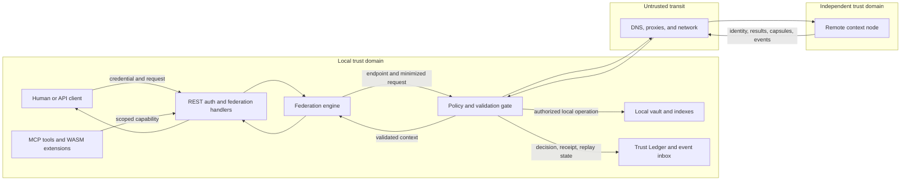

# Federation Threat Model

Status: Phase 0 security baseline  
Applies to: current federation code and the target sovereign interoperability fabric  
Primary evidence date: 2026-07-26

## Executive summary

MindVault federation crosses the strongest trust boundary in the system: a private local vault exchanges queries, identity claims, and context with independently operated nodes. Every remote node, connector, extension, response, and embedded instruction must therefore be treated as hostile until authenticated, authorized, bounded, and validated.

The current federation implementation is an experimental transport, not a production security boundary. Its strongest controls are outbound connection timeouts, optional HMAC request signing, constant-time signature comparison, global REST authentication middleware, bind-safety checks, and a WASM host-call allowlist. Material gaps remain:

- peer endpoints are caller supplied and can reach arbitrary URLs;
- peer identity and public keys are self-asserted rather than cryptographically proven;
- federation HMAC verification is not connected to an inbound server route;
- secrets and peer registrations are process-local rather than brokered and durable;
- queries are broadcast to enabled peers with incomplete namespace minimization;
- remote results have no signed provenance envelope, byte limit, or trust classification;
- federation audit is optional, and revocation has no durable propagation mechanism;
- the target Context Grant, Tool Grant, Context Capsule, Trust Ledger, and idempotent event inbox/outbox are architectural contracts, not implemented controls.

Production federation must remain disabled until the high-priority release gates in this document are satisfied. Remote results may be displayed as untrusted context during development, but they must not silently become authoritative facts, executable instructions, or mutation authority.

## Scope and assumptions

In scope:

- peer enrollment, identity discovery, health checks, and federated query execution in `crates/mv-engine/src/federation.rs`;
- federation REST routes and authorization in `crates/mv-server/src/rest/federation.rs`;
- shared REST authentication, bind safety, rate limiting, and audit behavior in `crates/mv-server/src/auth.rs`, `crates/mv-server/src/lib.rs`, `crates/mv-server/src/rest.rs`, and `crates/mv-server/src/audit.rs`;
- extension and MCP boundaries in `crates/mv-plugin/src/` and `crates/mv-mcp/src/`;
- the target contracts defined by the interoperability constitution and the accompanying Phase 0 architecture documents;
- design-time threats for future remote MCP, Context Capsules, signed events, and source synchronization.

Out of scope:

- compromise of the host operating system, process memory by a privileged local attacker, or a trusted administrator acting maliciously;
- security of external TLS terminators, DNS providers, identity providers, secret managers, or deployment platforms beyond MindVault’s use of them;
- build and CI supply-chain controls except where an installed extension becomes an active federation participant;
- availability of the public internet or remote organizations’ internal infrastructure.

Deployment and trust assumptions:

- nodes may be internet reachable and operated by different organizations;
- a node is single-tenant by default; a multi-tenant deployment requires an additional tenant-isolation threat model;
- peers, connectors, extensions, remote content, and content-embedded instructions are hostile by default;
- local vault data may include highly sensitive personal, organizational, or regulated information;
- external side effects require explicit policy approval and a verifiable receipt;
- TLS is expected for production transport, but the current code does not enforce an `https` scheme;
- federation is opt-in and should fail closed when authentication, policy, audit, or identity verification is unavailable;
- current bind safety reduces accidental remote exposure, but it is not a federation authorization control.

The model distinguishes implemented controls from target controls. A target contract is not credited as an existing mitigation until runtime evidence and tests demonstrate enforcement.

## System model

### Primary components

- **REST API and authentication middleware:** authenticates bearer/JWT/access/consumer credentials and assigns coarse Admin, Write, or Read roles, with an optional namespace.
- **Federation REST handlers:** enroll peers, initiate handshakes, report peer health, expose node identity, and initiate federated queries.
- **Federation engine:** keeps an in-memory peer registry, constructs outbound requests, optionally signs them with a shared secret, parses peer responses, and merges results.
- **Local vault and indexes:** hold canonical local nodes and retrieval indexes. Current federated query results are returned to callers rather than automatically persisted.
- **Remote context node:** an independently operated and potentially malicious identity, query, health, capsule, or event endpoint.
- **MCP and extension boundary:** lets tools and WASM extensions read or propose changes through scoped host capabilities.
- **Target policy and validation gate:** the future enforcement point for Context Grants, Tool Grants, source authority, provenance, schema, freshness, size, and content-safety checks.
- **Target Trust Ledger and event transport:** the future durable record for grants, decisions, receipts, peer state, revocations, signed outbox events, replay protection, and idempotent inbox processing.

### Data flows and trust boundaries

1. A local client crosses the API boundary with a bearer credential and requests peer enrollment or a federated query.
2. The server authorizes the request using its current coarse role and optional namespace context.
3. The federation engine accepts a configured endpoint, resolves and connects to it, and receives a self-described peer identity.
4. For a query, the engine sends query text and selected parameters to each enabled peer.
5. A remote peer returns JSON nodes and self-reported scores; the engine merges, sorts, and returns them to the caller.
6. In the target design, node descriptors, grants, capsules, and events cross the same organizational boundary but must pass cryptographic identity, policy, provenance, replay, and resource checks first.
7. MCP tools and extensions cross a separate local capability boundary. They must not use federation as a confused deputy to obtain network, data, or mutation authority they were not explicitly granted.

Trust boundaries:

- **TB-1 — Client to local API:** credentials, requested action, namespace, and resource scope must be authenticated and authorized.
- **TB-2 — Local policy domain to outbound network:** endpoints and disclosed query/data must be constrained before DNS resolution or transmission.
- **TB-3 — Network to remote node:** transport identity is not equivalent to MindVault node identity.
- **TB-4 — Remote response to local process:** all bytes, metadata, scores, provenance, and embedded instructions are untrusted.
- **TB-5 — Extension/MCP to canonical engine:** tool identity and capability must remain narrower than the user or host process authority.
- **TB-6 — Node event to durable state:** signatures, source authority, ordering, idempotency, revocation, and conflict policy must be enforced before mutation.

#### Diagram

`G` and `L` are required target boundaries. The current runtime performs only fragments of those responsibilities.

## Assets and security objectives

| Asset | Security objectives |
|---|---|
| Local vault content and derived indexes | Confidentiality; namespace and purpose limitation; integrity; no implicit disclosure or overwrite |
| Query text, filters, and retrieval intent | Confidentiality; per-peer minimization; unlinkability where practical; bounded retention |
| Node identity and signing keys | Authenticity; proof of possession; rotation; revocation; resistance to substitution |
| Peer registry and trust decisions | Integrity; durability; attributable changes; fail-closed enablement |
| Context Grants and Tool Grants | Least privilege; audience/resource/purpose binding; expiry; revocation; non-transferability |
| Context Capsules and remote results | Provenance; integrity; freshness; schema validity; explicit trust class; safe rendering |
| Source authority and conflict state | Deterministic ownership; no silent divergence; reproducible conflict resolution |
| Event inbox/outbox and replay state | Authenticity; ordering; idempotency; bounded replay window; durable acknowledgement |
| Shared secrets and brokered credentials | Confidentiality; non-exportability where possible; rotation; no logging or echoing |
| Audit records, policy decisions, and Action Receipts | Completeness; integrity; attribution; correlation; retention; inspectability |
| Service resources and network position | Availability; bounded CPU, memory, connections, bytes, and egress destinations |
| User agency and consent state | Explicit approval for sensitive disclosure and external effects; revocable delegation |

## Attacker model

### Capabilities

- controls a remote node, its responses, timing, redirects, certificates for attacker-owned domains, and embedded content;
- obtains a legitimate low- or medium-privilege local credential, or induces an authorized user/tool to invoke federation;
- supplies endpoints that resolve to attacker-chosen addresses or change resolution over time;
- observes or replays traffic where TLS or application-layer freshness controls are absent or misconfigured;
- returns oversized, deeply nested, malformed, adversarial, or instruction-bearing JSON content;
- manipulates self-reported identifiers, public keys, scores, namespaces, provenance, timestamps, and capabilities;
- publishes a malicious or compromised extension and requests broad network or host capabilities;
- races revocation, retries events, reorders messages, or exploits partial failures across nodes;
- exploits configuration mistakes such as disabled authentication, broad tokens, disabled audit, or insecure remote binding.

### Non-capabilities

- does not begin with root access to the local host or arbitrary local process-memory read/write;
- cannot break correctly implemented modern cryptography or forge signatures without key compromise;
- cannot alter trusted source code, binaries, or deployment configuration without a separate supply-chain compromise;
- cannot compel an uncompromised external identity provider or secret manager to issue unauthorized credentials;
- cannot bypass an independently enforced egress proxy or network policy assumed to be correctly configured.

## Entry points and attack surfaces

| Entry point | Current exposure and evidence | Security concern |
|---|---|---|
| `POST /api/v1/federation/peers` | `crates/mv-server/src/rest/federation.rs` `add_peer`; accepts endpoint and optional shared secret after `authorize_write` | Arbitrary endpoint enrollment, secret handling, privilege too broad |
| `POST /api/v1/federation/handshake` | `federation_handshake`; calls `FederationEngine::handshake` with caller-supplied URL | SSRF, redirects, identity spoofing, automatic enablement |
| `GET /api/v1/federation/identity` | `federation_identity`; protected only by ordinary read authorization | Identity enumeration and incompatible federation authentication |
| `POST /api/v1/federation/query` | `federated_query`; ordinary read authorization and fan-out to enabled peers | Query exfiltration, scope failure, response poisoning, fan-out DoS |
| `GET /api/v1/federation/health/:id` | `peer_health`; outbound request to stored endpoint | Repeated SSRF and service probing |
| Outbound HTTP client | `crates/mv-engine/src/federation.rs` `FederationEngine::new`, `handshake`, `health_check`, `query_peer` | No scheme/IP/DNS/redirect policy or response-byte ceiling |
| Federation HMAC headers | `sign_request` and `verify_federation_request` | Optional symmetric auth; verifier has no production inbound call site; timestamp replay window lacks nonce |
| Remote JSON nodes | `query_peer` deserializes peer-controlled `KnowledgeNode` values | Unbounded content, forged provenance/score, prompt injection |
| REST authentication configuration | `crates/mv-server/src/auth.rs` `AuthConfig::is_enabled` and authorization helpers | Auth-disabled mode becomes Admin; shared token defaults to Admin |
| External bind override | `crates/mv-server/src/lib.rs` `check_bind_safety` | Operators can explicitly permit unauthenticated non-loopback exposure |
| Audit configuration | `crates/mv-server/src/audit.rs` `AuditConfig::from_env` | Audit is optional and memory retention is bounded |
| WASM host ABI | `crates/mv-plugin/src/sandbox.rs` `PermissionGate`; `wasm_plugin.rs` | Confused deputy, broad network permission, incomplete runtime resource limits |
| MCP stdio tools | `crates/mv-mcp/src/server.rs`, `auth.rs`, and `tools.rs` | Scope propagation, untrusted tool output, future remote transport |
| Future capsule/event ingestion | Architectural contracts only; no runtime symbols for Context Grant, Context Capsule, Trust Ledger, or durable inbox/outbox | Signature, replay, conflict, revocation, and authority failures |

## Top abuse paths

1. **Use peer enrollment as an internal network oracle.** An attacker with Write authority submits a loopback, link-local, private, metadata-service, or redirecting endpoint. Handshake, health, or query requests originate from the trusted MindVault host and disclose reachability or response content.
2. **Impersonate a trusted node during handshake.** An attacker returns a chosen `vault_id` and `public_key` from the identity endpoint. Because there is no challenge proving key possession or out-of-band trust decision, the peer is stored and enabled as the claimed identity.
3. **Exfiltrate sensitive intent through query fan-out.** A user or compromised tool initiates a federated query. The full query is sent to every enabled peer, and a peer with zero or multiple allowed namespaces receives no namespace restriction from the current request builder.
4. **Poison reasoning with a malicious remote result.** A hostile peer supplies crafted node text, metadata, or an inflated score. The response is deserialized and ranked without a signed provenance envelope or trust class, causing a downstream model or user to treat attacker content as authoritative instructions or evidence.
5. **Replay or bypass federation authentication.** A captured signed request is replayed within the five-minute timestamp window, or a peer endpoint relies on ordinary REST authentication that does not consume the federation HMAC headers. Optional secrets create inconsistent fail-open deployments.
6. **Exhaust local resources through peer fan-out.** Many enabled or slow peers return large JSON bodies or expensive structures concurrently. Total request timeouts limit duration but not aggregate connections, response bytes, parsing memory, or repeated caller-triggered work.
7. **Steal or misuse shared federation secrets.** A shared secret enters through an API DTO and remains as an ordinary in-memory string. A logging, crash, debugging, operator, or extension compromise can expose a reusable symmetric credential with no audience separation.
8. **Exploit an extension as a federation confused deputy.** A plugin with broad network or canonical node host calls induces the host to disclose data or perform operations beyond the plugin’s intended purpose. The current manifest does not bind network destinations, data classes, secret handles, or retention.
9. **Reintroduce revoked or conflicting state through asynchronous sync.** A malicious or stale node replays an event, omits a tombstone, or claims authority for a record it does not own. Without a durable signed inbox, sequence state, idempotency key, and source-authority check, nodes silently diverge.

## Threat model table

| Threat ID | Threat source | Prerequisites | Threat action | Impact | Impacted assets | Existing controls (evidence) | Gaps | Recommended mitigations | Detection ideas | Likelihood | Impact severity | Priority |
|---|---|---|---|---|---|---|---|---|---|---|---|---|
| TM-001 | Authorized malicious client, compromised tool, or malicious operator | Ability to add/handshake a peer or influence a stored endpoint | Targets internal, loopback, link-local, metadata, private, or redirect destinations through server-side HTTP | Internal service discovery, credential theft, data exposure, network pivot | Service network position, local/cloud credentials, peer registry | `FederationEngine::new` sets 5-second connect and 10-second total timeouts; `check_bind_safety` reduces accidental unauthenticated remote exposure | No HTTPS requirement, URL canonicalization, DNS/IP allow policy, redirect control, rebinding defense, egress allowlist, or admin-only enrollment | Central endpoint policy; require HTTPS; reject credentials/fragments; resolve and validate every address; block loopback/private/link-local/metadata ranges; disable redirects or revalidate each hop; pin destination; use egress proxy; require federation-admin grant | Log normalized endpoint, resolved IPs, redirect chain, requester, decision, and blocked-address reason; alert on private ranges and endpoint churn | High | High | High |
| TM-002 | Malicious remote node or on-path attacker | Attacker can answer identity request or redirect traffic | Self-asserts another node’s ID/public key, then becomes enabled | Peer impersonation, trust substitution, later data disclosure or poisoning | Node identity, peer registry, grants, remote results | Duplicate `vault_id` check in `FederationEngine::handshake`; public key field is retained; TLS may be supplied by deployment | No proof of key possession, signed descriptor, trust anchor, certificate binding, fingerprint confirmation, rotation, revocation, or quarantine state | Signed Node Descriptor; nonce challenge; proof of possession; out-of-band fingerprint or approved directory; mTLS or application-bound identity; explicit pending/approved/enabled states; rotation and revocation protocol | Record descriptor digest, key fingerprint, approver, challenge result, certificate identity, and all key/state changes; alert on identity reuse or key change | High | High | High |
| TM-003 | Malicious peer, compromised client/tool, or configuration error | Federation enabled and caller has Read authority | Broadcasts sensitive query/filter context to peers outside the intended purpose or namespace | Confidentiality breach, organizational intelligence leakage, regulatory exposure | Query text, retrieval intent, local namespace and consent state | Current auth supports an optional namespace; `FederationPeer` has `allowed_namespaces` and `max_results` | Full query fans out to all enabled peers; zero or multiple allowed namespaces produce no namespace in the request; no per-peer purpose, data-class, audience, field, or retention grant | Context Grant per peer and request; explicit namespace intersection; deny empty/ambiguous scope; per-peer query plan; redact/tokenize sensitive terms; disclose peer list and require approval for sensitive classes; bounded retention contract | Audit request-to-peer disclosure map and grant ID; data-loss detection on query fields; alert on broad fan-out, empty scope, and sensitive-term egress | High | High | High |
| TM-004 | Malicious or compromised peer | Ability to answer a federated query | Returns forged nodes, scores, provenance, links, or embedded instructions | Retrieval poisoning, prompt injection, unsafe user action, false attribution, downstream integrity loss | Context Capsules, remote results, user agency, local decisions | Rust/Serde typed deserialization; peer result count is truncated after aggregation; current federation query does not automatically persist results | No signed response envelope, response-byte cap, provenance verification, trust class, schema negotiation, content separation, or score normalization | Signed Context Capsule containing issuer, audience, source, digest, schema, freshness, and grant; strict byte/count/depth limits; normalize scores locally; label and render remote content as untrusted data; never execute embedded instructions; require explicit promotion before persistence | Preserve raw envelope digest and validation outcome; prompt-injection classifiers as detection only; alert on invalid signatures, score anomalies, schema drift, and repeated rejected content | High | High | High |
| TM-005 | Network observer, malicious peer, or misconfigured node | Captured request, absent shared secret, or expectation that HMAC authenticates inbound REST | Replays a request or reaches an endpoint whose auth layer ignores federation headers | Unauthorized query execution, inconsistent interoperability, false confidence in authentication | Grants, query confidentiality, audit attribution, node identity | `verify_federation_request` checks HMAC in constant time and enforces a ±5-minute timestamp; ordinary REST auth middleware is global | Verifier is only referenced by tests; outbound HMAC is optional; no nonce/request ID cache; ordinary REST auth does not consume the HMAC headers; symmetric secret lacks audience binding | Dedicated federation authentication middleware; mandatory asymmetric request signatures or mTLS-bound tokens; audience, method, path, body digest, grant ID, nonce, and narrow expiry; durable replay cache; reject unsigned/unknown-key traffic | Correlate signature key, node ID, nonce, grant, and request ID; alert on replay, clock skew, auth-mode downgrade, unsigned calls, and HMAC/REST identity mismatch | High | High | High |
| TM-006 | Malicious peers or abusive authenticated caller | Ability to trigger queries/health checks and control peer response behavior | Holds connections, returns very large bodies, amplifies fan-out, or causes repeated parse/sort work | Memory/CPU/socket exhaustion and degraded local availability | Service resources, local availability, audit pipeline | Reqwest connect/total timeouts; peer `max_results`; global rate-limit middleware can be enabled | No response-byte/depth cap, global federation concurrency budget, per-peer circuit breaker, max peer fan-out, streaming parser, cancellation budget, or durable backoff; rate limiting can be disabled | Per-request and global concurrency budgets; body/decompression/depth limits; maximum peers; circuit breaker and exponential backoff; caller and peer quotas; cancellation propagation; bounded merge heap; isolate federation workers | Metrics by peer for bytes, latency, errors, open connections, cancellations, and parse failures; alert on amplification ratio and breaker activity | High | Medium | High |
| TM-007 | Local attacker with process/log access, compromised extension, or accidental operator exposure | Shared-secret federation configured | Reads, logs, reuses, or exfiltrates a symmetric peer secret | Peer impersonation and unauthorized signed requests until rotation | Shared secrets, node identity, grants | Secret is not returned by the peer-list response; HMAC comparison is constant time | Secret is accepted in JSON and stored as `Option<String>` in process memory; no broker handle, envelope encryption, per-direction key, automated rotation, or explicit redaction contract | Prefer asymmetric keys; otherwise store only a secret-manager handle; separate inbound/outbound and peer/audience keys; redact DTOs/logs/traces; zeroize transient buffers where practical; rotate and revoke; never expose secrets to extensions | Secret-access audit from broker; canary-secret detection; alert on old-key use, multi-origin use, and failed rotations | Medium | High | High |
| TM-008 | Malicious user/peer or ordinary operational failure | Audit disabled, peer state lost on restart, or revocation not propagated | Denies actions, reenables stale trust, or continues using a revoked grant/key | Repudiation, forensic gaps, unauthorized continued access, inconsistent peer state | Audit records, peer registry, revocations, Action Receipts | Global audit middleware exists with file/console/webhook sinks; peer removal and enable/disable functions exist in memory | Audit defaults off; in-memory peer registry and bounded audit buffer; no mandatory federation event taxonomy, durable Trust Ledger, signed receipt, or revocation acknowledgement | Mandatory durable federation audit; append-only Trust Ledger; explicit peer state machine; signed Action Receipts; revocation epoch and acknowledgement; startup fail-closed if state cannot load; retention and integrity controls | Alert on audit-disabled federation, peer-state rollback, grant use after revocation, missing receipt, and unexplained key/state change | Medium | High | High |
| TM-009 | Malicious or compromised extension/tool | Extension installed with broad permissions or MCP scope | Uses host network/data authority as a confused deputy or smuggles remote instructions into privileged calls | Data exfiltration, unauthorized mutation, policy bypass | Vault data, secrets, grants, user agency | `PermissionGate` allowlists known WASM host calls; Wasmtime fuel and 1 MiB result limit; MCP scopes actions/resources and current mutations are proposal-oriented | Manifest network access is broad; checksum/signature optional; no destination/data-class/secret/retention grant; no explicit wall-clock or memory cap observed; tool outputs lack federation provenance contract | Signed publisher/package identity; destination-specific Network Grant; capability broker for secrets; memory, wall-clock, fuel, output, and call-count budgets; Tool Grant propagation; taint remote content; approval for sensitive disclosure/effects | Attribute every host call to extension, package digest, Tool Grant, destination, and data class; alert on denied calls, grant expansion, unusual egress, and resource exhaustion | Medium | High | High |
| TM-010 | Malicious/stale peer or concurrent legitimate writers | Future event/capsule synchronization is enabled without durable enforcement | Replays, reorders, duplicates, suppresses tombstones, or writes outside source authority | Silent divergence, resurrected data, conflicting canonical state, irreproducible decisions | Source authority, event inbox/outbox, canonical nodes, revocations | `SOURCE_AUTHORITY_MODEL.md` and `PROTOCOL_BOUNDARIES.md` define the required target contract | No implemented signed event envelope, durable outbox/inbox, sequence/replay state, idempotency key, authority check, conflict ledger, or convergence test | Implement transactional outbox and durable inbox; signed event ID, issuer, sequence, body digest, schema, authority, and expiry; idempotent application; tombstones; deterministic conflict policy; quarantine; reconciliation and convergence tests | Monitor duplicate/reordered events, sequence gaps, authority violations, tombstone resurrection, reconciliation drift, and non-convergent replicas | Medium when enabled | High | High release blocker |

## Criticality calibration

- **Critical:** unauthenticated or low-friction compromise causing cross-tenant disclosure, arbitrary code execution, broad irreversible mutation, credential theft with immediate fleet-wide reach, or durable safety-boundary bypass. No current threat is labeled Critical under the stated single-tenant, opt-in, authenticated, local-default deployment assumption. TM-001 or TM-003 becomes Critical if an internet-exposed or multi-tenant deployment allows low-privilege callers to reach other tenants, cloud metadata credentials, or privileged internal control planes.
- **High:** realistic compromise of sensitive context, node identity, integrity, user agency, or sustained availability across an organizational boundary. High items block production federation.
- **Medium:** meaningful but bounded impact, additional prerequisites, or strong operational recovery. Medium items require ownership and a dated remediation plan before general availability.
- **Low:** limited impact with straightforward detection and recovery. Low does not mean optional; accepted risk must be documented.

Priority combines likelihood, impact, exposure, and reversibility. A design-time threat can be a High release blocker even before an exploitable runtime exists, because shipping the capability without its boundary would create the exposure.

## Focus paths for security review

| Focus path | Why it matters | Required evidence before production |
|---|---|---|
| Endpoint resolution and outbound transport | Primary SSRF and network-pivot boundary | Unit and integration tests for schemes, IP classes, DNS rebinding, redirects, proxies, IPv4/IPv6, metadata endpoints, and egress failure |
| Node identity lifecycle | Every later grant and signature depends on correct peer identity | Signed descriptor, proof-of-possession handshake, trust approval, key rotation/revocation tests, and identity-change audit |
| Federation authentication and grants | Current HMAC verifier is not wired into inbound routing | End-to-end signed request test proving audience, grant, nonce, expiry, body digest, replay rejection, and fail-closed behavior |
| Query minimization and namespace intersection | Full-query broadcast creates direct confidentiality risk | Policy tests for zero/one/many namespaces, purpose and data classes, per-peer redaction, user disclosure, and denial on ambiguity |
| Remote response and Context Capsule validation | Hostile content can poison retrieval and model behavior | Signature/provenance/schema/freshness verification, strict parser/resource limits, trust labels, score normalization, and prompt-injection containment tests |
| Peer registry, audit, and revocation | In-memory state and optional audit cannot support durable trust | Durable state migration, mandatory audit configuration, append-only decision/receipt records, crash recovery, and revocation propagation tests |
| Extension and MCP delegation | Tools can become confused deputies across the network boundary | Signed package identity, Tool Grant propagation, destination-scoped network access, secret broker isolation, and adversarial plugin tests |
| Event sync and source authority | Replay and conflicts can silently corrupt canonical state | Transactional outbox/inbox, idempotency, signatures, tombstones, conflict quarantine, reconciliation, and multi-node convergence tests |
| Resource exhaustion | Timeouts alone do not bound aggregate work | Load/fuzz tests for peer fan-out, compressed and oversized responses, slow peers, parser depth, circuit breakers, quotas, and cancellation |

## Quality check

- Every current control is tied to a repository path or symbol; architectural documents are not counted as implemented enforcement.
- Each threat names prerequisites, impact, assets, gaps, mitigations, and detection signals.
- Remote content and peer identity are modeled as hostile independently of transport security.
- Confidentiality, integrity, availability, provenance, authorization, revocation, replay, supply chain, and confused-deputy risks are covered.
- Future federation mechanisms are labeled as target contracts and production release gates, not represented as existing code.
