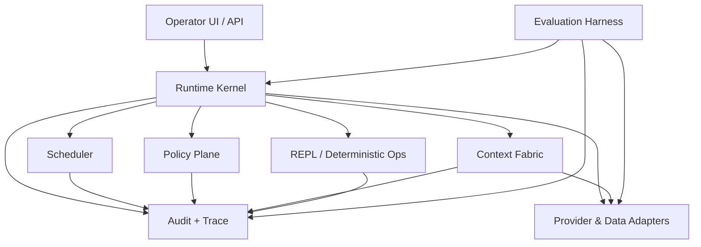

# Proprietary RLM Core - Component Boundaries

## Component Diagram (Mermaid)

## Responsibility Split

- **Runtime Kernel**
  - Run graph state machine
  - Parent/child orchestration
  - Merge orchestration hooks

- **Scheduler**
  - Queueing, worker allocation, concurrency fairness
  - Budget-aware scheduling and backpressure decisions

- **Policy Plane**
  - Policy evaluation, inheritance narrowing, egress/tool restrictions
  - Emergency stop / kill switch controls

- **Context Fabric**
  - ContextRef abstraction
  - Lazy materialization + immutable snapshots
  - Context lineage metadata

- **REPL / Deterministic Ops**
  - Sandboxed program execution
  - Deterministic transforms (count/filter/diff/join/etc.)

- **Audit + Trace**
  - Event ingestion/persistence
  - Provenance graph and replay support
  - Explainability primitives

- **Evaluation Harness**
  - Benchmarks, regression gates, quality/cost/latency scoring

- **Adapters**
  - Model provider adapters
  - Storage/document source adapters
  - Tool connectors

## Boundary Rules

1. Core domain model lives in Runtime/Context/Policy/Audit boundary, not in adapters.
2. Adapters implement interfaces exposed by core; core never imports adapter internals.
3. Evaluation harness reads core outputs and metrics but does not mutate runtime state.
