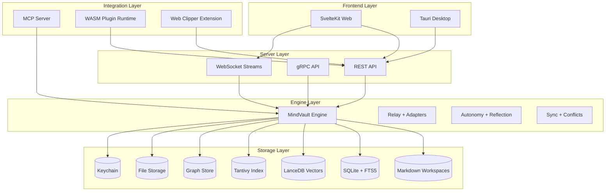

# MindVault Architecture Overview

> This diagram describes the current local runtime. The target product
> architecture is governed by `INTEROPERABILITY_CONSTITUTION.md` and ADR 011:
> a logically central, physically decentralized network of Context Nodes.

## High-Level Components

## Data Flow Summary

- **Human-authored documents**: Native Library documents and their folder
  hierarchy are canonical Markdown files and directories. The Engine guards
  writes and projects document content and identity into SQLite, full-text,
  vector, and graph indexes.
- **Structured ingest**: UI/Adapters submit entities, claims, tasks, evidence,
  relationships, and other structured nodes to the REST API. The Engine
  normalizes and stores them in SQLite, then updates derived indexes.
- **Recall/Search**: Queries hit the Engine, which blends vector search, full-text search, and graph traversal to return ranked results.
- **Agentic Loop**: The Engine emits events to the Proactive/Intent systems, which generate insights and suggestions for the UI.
- **Attachments**: Files are stored on disk, metadata stored in SQLite, and content chunks indexed for search.
- **Observability**: Metrics are recorded in-process and exposed via `/metrics` and `/api/v1/metrics/*`.

## Boundaries & Ownership

- **mv-core**: Domain models + storage traits.
- **mv-storage**: SQLite and LanceDB implementations.
- **mv-engine**: Business logic and orchestration.
- **mv-server**: REST/gRPC API surface, auth, and middleware.
- **mv-mcp**: MCP stdio server for agent interoperability.
- **mv-plugin**: WASM plugin runtime + hooks.
- **frontend/web/tauri**: UI and desktop shell.

The accepted file-first Library contract, identity and mutation boundary,
migration boundary, and delivery stages are defined in
`knowledge-workspace.md`, ADR 008, and ADR 009. Until the staged migration and
runtime conformance gates are verified, the existing database-backed Notes
implementation remains authoritative.

ADR 010 defines a second, orthogonal boundary: sovereign Personal Vaults plus
governed Collaborative Spaces. The diagram above describes the current local
runtime and does not imply that relay channels or namespaces already provide
shared-space membership, authorization, or canonical shared state. The
repository baseline and migration seams are recorded in
`collaborative-spaces-baseline.md`.

The `INTEROPERABILITY_CONSTITUTION.md` and ADR 011 now govern both domains. They
extend MindVault into a logically central, physically decentralized context
fabric whose nodes preserve source authority, expose open protocol boundaries,
and support portable Context Capsules. The present runtime diagram describes
the implemented core; the staged transition is recorded in
`interoperability-baseline.md`.
